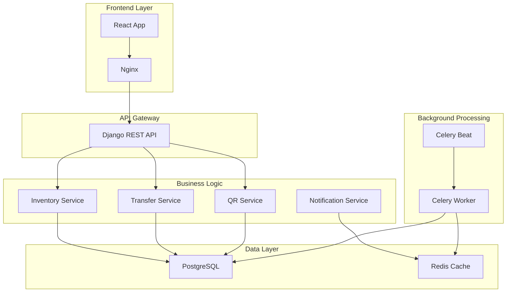
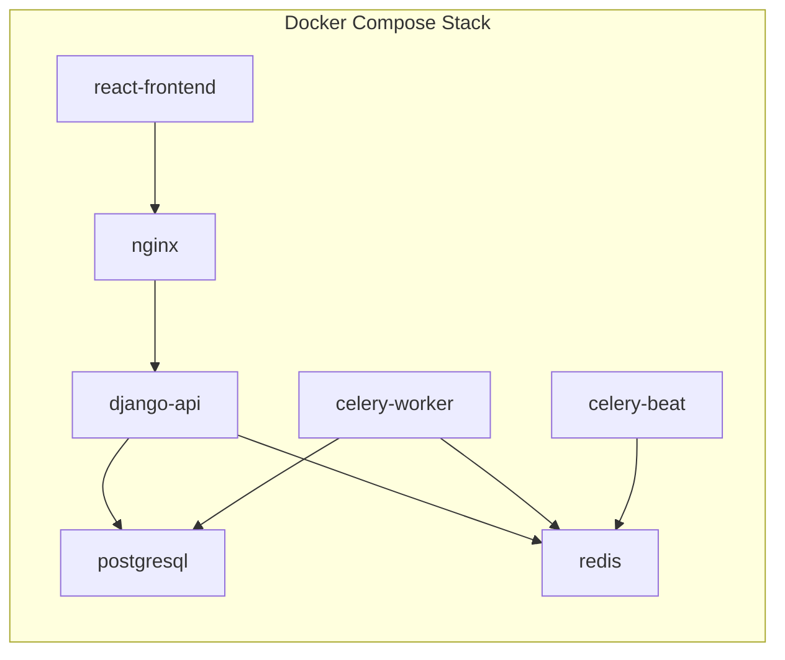
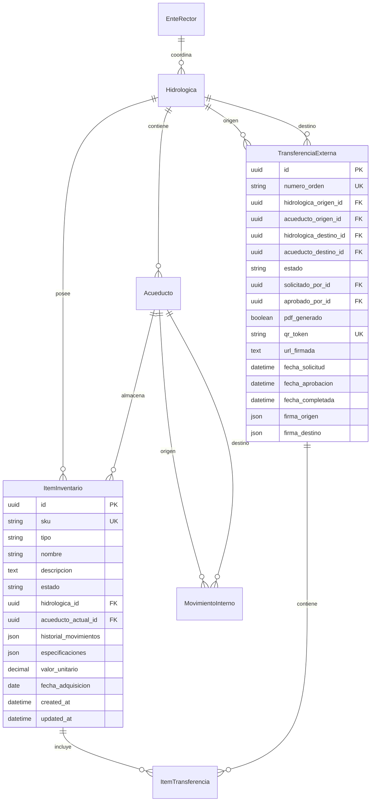

# Documento de Diseño

## Visión General

La plataforma de gestión de inventario es un sistema distribuido basado en microservicios que utiliza Django REST Framework como backend, React native como frontend, y está completamente contenedorizada con Docker. El sistema implementa multitenencia a nivel de base de datos para garantizar el aislamiento de datos entre hidrológicas, mientras permite al Ente Rector una vista global anonimizada.

## Arquitectura

### Arquitectura de Alto Nivel



### Arquitectura de Contenedores



## Componentes y Interfaces

### 1. Modelos de Datos Principales

#### Modelo de Entidades Organizacionales
```python
class EnteRector(models.Model):
    id = models.UUIDField(primary_key=True, default=uuid.uuid4)
    nombre = models.CharField(max_length=200)
    codigo = models.CharField(max_length=10, unique=True)
    created_at = models.DateTimeField(auto_now_add=True)

class Hidrologica(models.Model):
    id = models.UUIDField(primary_key=True, default=uuid.uuid4)
    ente_rector = models.ForeignKey(EnteRector, on_delete=models.CASCADE)
    nombre = models.CharField(max_length=200)
    codigo = models.CharField(max_length=10, unique=True)
    activa = models.BooleanField(default=True)
    created_at = models.DateTimeField(auto_now_add=True)

class Acueducto(models.Model):
    id = models.UUIDField(primary_key=True, default=uuid.uuid4)
    hidrologica = models.ForeignKey(Hidrologica, on_delete=models.CASCADE)
    nombre = models.CharField(max_length=200)
    codigo = models.CharField(max_length=20)
    ubicacion = models.JSONField(default=dict)  # Coordenadas GPS
    created_at = models.DateTimeField(auto_now_add=True)
```

#### Modelo de Inventario
```python
class TipoItem(models.TextChoices):
    TUBERIA = 'tuberia', 'Tubería'
    MOTOR = 'motor', 'Motor'
    VALVULA = 'valvula', 'Válvula'
    QUIMICO = 'quimico', 'Químico'

class EstadoItem(models.TextChoices):
    DISPONIBLE = 'disponible', 'Disponible'
    EN_TRANSITO = 'en_transito', 'En Tránsito'
    ASIGNADO = 'asignado', 'Asignado'
    MANTENIMIENTO = 'mantenimiento', 'En Mantenimiento'

class ItemInventario(models.Model):
    id = models.UUIDField(primary_key=True, default=uuid.uuid4)
    sku = models.CharField(max_length=50, unique=True)
    tipo = models.CharField(max_length=20, choices=TipoItem.choices)
    nombre = models.CharField(max_length=200)
    descripcion = models.TextField()
    estado = models.CharField(max_length=20, choices=EstadoItem.choices, default=EstadoItem.DISPONIBLE)
    
    # Multitenencia
    hidrologica = models.ForeignKey(Hidrologica, on_delete=models.CASCADE)
    acueducto_actual = models.ForeignKey(Acueducto, on_delete=models.CASCADE)
    
    # Ficha de Vida
    historial_movimientos = models.JSONField(default=list)
    
    # Metadatos
    especificaciones = models.JSONField(default=dict)
    valor_unitario = models.DecimalField(max_digits=12, decimal_places=2, null=True)
    fecha_adquisicion = models.DateField(null=True)
    created_at = models.DateTimeField(auto_now_add=True)
    updated_at = models.DateTimeField(auto_now=True)
```

#### Modelo de Transferencias
```python
class EstadoTransferencia(models.TextChoices):
    SOLICITADA = 'solicitada', 'Solicitada'
    APROBADA = 'aprobada', 'Aprobada'
    EN_TRANSITO = 'en_transito', 'En Tránsito'
    COMPLETADA = 'completada', 'Completada'
    RECHAZADA = 'rechazada', 'Rechazada'

class TransferenciaExterna(models.Model):
    id = models.UUIDField(primary_key=True, default=uuid.uuid4)
    numero_orden = models.CharField(max_length=20, unique=True)
    
    # Origen y Destino
    hidrologica_origen = models.ForeignKey(Hidrologica, on_delete=models.CASCADE, related_name='transferencias_salida')
    acueducto_origen = models.ForeignKey(Acueducto, on_delete=models.CASCADE, related_name='transferencias_salida')
    hidrologica_destino = models.ForeignKey(Hidrologica, on_delete=models.CASCADE, related_name='transferencias_entrada')
    acueducto_destino = models.ForeignKey(Acueducto, on_delete=models.CASCADE, related_name='transferencias_entrada')
    
    # Items
    items = models.ManyToManyField(ItemInventario, through='ItemTransferencia')
    
    # Estado y Workflow
    estado = models.CharField(max_length=20, choices=EstadoTransferencia.choices, default=EstadoTransferencia.SOLICITADA)
    solicitado_por = models.ForeignKey(User, on_delete=models.CASCADE, related_name='transferencias_solicitadas')
    aprobado_por = models.ForeignKey(User, on_delete=models.CASCADE, null=True, related_name='transferencias_aprobadas')
    
    # Orden de Traspaso
    pdf_generado = models.BooleanField(default=False)
    qr_token = models.CharField(max_length=255, unique=True, null=True)
    url_firmada = models.TextField(null=True)
    
    # Timestamps
    fecha_solicitud = models.DateTimeField(auto_now_add=True)
    fecha_aprobacion = models.DateTimeField(null=True)
    fecha_completada = models.DateTimeField(null=True)
    
    # Firmas Digitales
    firma_origen = models.JSONField(null=True)  # Timestamp y usuario que confirma salida
    firma_destino = models.JSONField(null=True)  # Timestamp y usuario que confirma recepción

class MovimientoInterno(models.Model):
    id = models.UUIDField(primary_key=True, default=uuid.uuid4)
    item = models.ForeignKey(ItemInventario, on_delete=models.CASCADE)
    acueducto_origen = models.ForeignKey(Acueducto, on_delete=models.CASCADE, related_name='movimientos_salida')
    acueducto_destino = models.ForeignKey(Acueducto, on_delete=models.CASCADE, related_name='movimientos_entrada')
    usuario = models.ForeignKey(User, on_delete=models.CASCADE)
    motivo = models.TextField()
    fecha_movimiento = models.DateTimeField(auto_now_add=True)
```

### 2. Servicios de Negocio

#### Servicio de Multitenencia
```python
class MultiTenantQuerySet(models.QuerySet):
    def for_hidrologica(self, hidrologica_id):
        return self.filter(hidrologica_id=hidrologica_id)

class MultiTenantManager(models.Manager):
    def get_queryset(self):
        return MultiTenantQuerySet(self.model, using=self._db)
    
    def for_hidrologica(self, hidrologica_id):
        return self.get_queryset().for_hidrologica(hidrologica_id)

# Middleware para filtrado automático
class MultiTenantMiddleware:
    def __init__(self, get_response):
        self.get_response = get_response
    
    def __call__(self, request):
        if hasattr(request.user, 'hidrologica'):
            request.hidrologica_id = request.user.hidrologica.id
        return self.get_response(request)
```

#### Servicio de Transferencias
```python
class TransferService:
    @staticmethod
    def solicitar_transferencia(hidrologica_origen, acueducto_origen, 
                              hidrologica_destino, acueducto_destino, 
                              items_solicitados, usuario):
        """Crea una nueva solicitud de transferencia externa"""
        transferencia = TransferenciaExterna.objects.create(
            numero_orden=TransferService._generar_numero_orden(),
            hidrologica_origen=hidrologica_origen,
            acueducto_origen=acueducto_origen,
            hidrologica_destino=hidrologica_destino,
            acueducto_destino=acueducto_destino,
            solicitado_por=usuario
        )
        
        # Asociar items
        for item_data in items_solicitados:
            ItemTransferencia.objects.create(
                transferencia=transferencia,
                item=item_data['item'],
                cantidad=item_data['cantidad']
            )
        
        # Notificar al Ente Rector
        NotificationService.notificar_nueva_solicitud(transferencia)
        return transferencia
    
    @staticmethod
    def aprobar_transferencia(transferencia_id, usuario_rector):
        """Aprueba una transferencia y genera la orden de traspaso"""
        transferencia = TransferenciaExterna.objects.get(id=transferencia_id)
        transferencia.estado = EstadoTransferencia.APROBADA
        transferencia.aprobado_por = usuario_rector
        transferencia.fecha_aprobacion = timezone.now()
        transferencia.save()
        
        # Generar orden de traspaso
        QRService.generar_orden_traspaso.delay(transferencia.id)
        
        return transferencia
```

#### Servicio de QR y Órdenes
```python
class QRService:
    @staticmethod
    @shared_task
    def generar_orden_traspaso(transferencia_id):
        """Genera PDF con QR code para la orden de traspaso"""
        transferencia = TransferenciaExterna.objects.get(id=transferencia_id)
        
        # Generar token único y URL firmada
        token = QRService._generar_token_seguro()
        url_firmada = QRService._crear_url_firmada(transferencia.id, token)
        
        # Actualizar transferencia
        transferencia.qr_token = token
        transferencia.url_firmada = url_firmada
        transferencia.save()
        
        # Generar PDF
        pdf_content = QRService._generar_pdf_orden(transferencia)
        
        # Guardar PDF (usando storage de Django)
        file_path = f"ordenes_traspaso/{transferencia.numero_orden}.pdf"
        default_storage.save(file_path, ContentFile(pdf_content))
        
        transferencia.pdf_generado = True
        transferencia.save()
        
        return file_path
    
    @staticmethod
    def validar_qr_token(token):
        """Valida un token QR y retorna información de la transferencia"""
        try:
            transferencia = TransferenciaExterna.objects.get(qr_token=token)
            
            # Verificar que la URL firmada sea válida
            if QRService._verificar_firma_url(transferencia.url_firmada):
                return {
                    'valido': True,
                    'transferencia': transferencia,
                    'estado': transferencia.estado,
                    'origen': transferencia.acueducto_origen.nombre,
                    'destino': transferencia.acueducto_destino.nombre,
                    'items': transferencia.items.all()
                }
        except TransferenciaExterna.DoesNotExist:
            pass
        
        return {'valido': False}
```

### 3. APIs REST

#### ViewSets Principales
```python
class ItemInventarioViewSet(viewsets.ModelViewSet):
    serializer_class = ItemInventarioSerializer
    permission_classes = [IsAuthenticated]
    filter_backends = [DjangoFilterBackend, SearchFilter]
    filterset_fields = ['tipo', 'estado', 'acueducto_actual']
    search_fields = ['nombre', 'sku', 'descripcion']
    
    def get_queryset(self):
        user = self.request.user
        if user.is_ente_rector:
            # Vista global anonimizada para Ente Rector
            return ItemInventario.objects.select_related('hidrologica').all()
        else:
            # Vista filtrada por hidrológica
            return ItemInventario.objects.filter(
                hidrologica=user.hidrologica
            ).select_related('acueducto_actual')

class TransferenciaExternaViewSet(viewsets.ModelViewSet):
    serializer_class = TransferenciaExternaSerializer
    permission_classes = [IsAuthenticated]
    
    @action(detail=True, methods=['post'])
    def aprobar(self, request, pk=None):
        """Endpoint para que el Ente Rector apruebe transferencias"""
        if not request.user.is_ente_rector:
            return Response({'error': 'Sin permisos'}, status=403)
        
        transferencia = self.get_object()
        TransferService.aprobar_transferencia(transferencia.id, request.user)
        
        return Response({'status': 'aprobada'})
    
    @action(detail=False, methods=['get'])
    def pendientes_aprobacion(self, request):
        """Lista transferencias pendientes de aprobación"""
        if not request.user.is_ente_rector:
            return Response({'error': 'Sin permisos'}, status=403)
        
        transferencias = TransferenciaExterna.objects.filter(
            estado=EstadoTransferencia.SOLICITADA
        )
        serializer = self.get_serializer(transferencias, many=True)
        return Response(serializer.data)

class QRValidationViewSet(viewsets.ViewSet):
    permission_classes = [AllowAny]  # Acceso público para escaneo
    
    @action(detail=False, methods=['get'])
    def validar(self, request):
        """Valida un token QR y retorna información de transferencia"""
        token = request.query_params.get('token')
        if not token:
            return Response({'error': 'Token requerido'}, status=400)
        
        resultado = QRService.validar_qr_token(token)
        return Response(resultado)
```

## Modelos de Datos

### Esquema de Base de Datos



### Índices de Base de Datos
```sql
-- Índices para multitenencia
CREATE INDEX idx_item_hidrologica ON inventory_itemInventario(hidrologica_id);
CREATE INDEX idx_item_acueducto ON inventory_itemInventario(acueducto_actual_id);

-- Índices para búsquedas
CREATE INDEX idx_item_sku ON inventory_itemInventario(sku);
CREATE INDEX idx_item_tipo_estado ON inventory_itemInventario(tipo, estado);

-- Índices para transferencias
CREATE INDEX idx_transferencia_estado ON inventory_transferenciaExterna(estado);
CREATE INDEX idx_transferencia_qr ON inventory_transferenciaExterna(qr_token);
CREATE INDEX idx_transferencia_fecha ON inventory_transferenciaExterna(fecha_solicitud);
```

## Correctness Properties

*Una propiedad es una característica o comportamiento que debe mantenerse verdadero en todas las ejecuciones válidas de un sistema, esencialmente, una declaración formal sobre lo que el sistema debe hacer. Las propiedades sirven como puente entre especificaciones legibles por humanos y garantías de corrección verificables por máquinas.*

### Propiedades de Integridad Organizacional

**Propiedad 1: Unicidad del Ente Rector**
*Para cualquier* estado del sistema, debe existir exactamente un Ente_Rector activo
**Valida: Requerimientos 1.1**

**Propiedad 2: Cantidad fija de Hidrológicas**
*Para cualquier* estado del sistema, debe existir exactamente 16 Hidrológicas activas
**Valida: Requerimientos 1.2**

**Propiedad 3: Capacidad de asociación múltiple**
*Para cualquier* Hidrológica creada, el sistema debe permitir asociar múltiples Acueductos sin límite superior
**Valida: Requerimientos 1.3**

**Propiedad 4: Unicidad de identificadores organizacionales**
*Para cualquier* conjunto de entidades organizacionales (EnteRector, Hidrologica, Acueducto), todos los identificadores UUID deben ser únicos
**Valida: Requerimientos 1.4**

### Propiedades de Inventario y Trazabilidad

**Propiedad 5: Unicidad de identificadores de inventario**
*Para cualquier* ItemInventario registrado, su UUID y SKU deben ser únicos en todo el sistema
**Valida: Requerimientos 2.1**

**Propiedad 6: Existencia de Ficha de Vida**
*Para cualquier* ItemInventario, debe existir un historial_movimientos (Ficha_Vida) inicializado
**Valida: Requerimientos 2.2**

**Propiedad 7: Registro de movimientos en historial**
*Para cualquier* movimiento (interno o externo) de un ítem, debe registrarse una entrada en el historial_movimientos del ítem
**Valida: Requerimientos 2.3**

**Propiedad 8: Validez de tipos de ítem**
*Para cualquier* ItemInventario, su tipo debe pertenecer al conjunto {tuberia, motor, valvula, quimico}
**Valida: Requerimientos 2.4**

**Propiedad 9: Validez de estados de ítem**
*Para cualquier* ItemInventario, su estado debe pertenecer al conjunto {disponible, en_transito, asignado, mantenimiento}
**Valida: Requerimientos 2.5**

### Propiedades de Multitenencia

**Propiedad 10: Aislamiento de datos por hidrológica**
*Para cualquier* usuario de Hidrologica, las consultas de inventario deben retornar únicamente ítems de su hidrológica
**Valida: Requerimientos 3.1**

**Propiedad 11: Anonimización en búsqueda global**
*Para cualquier* búsqueda global del Ente_Rector, los resultados de otras hidrológicas deben estar anonimizados (sin detalles específicos de ubicación)
**Valida: Requerimientos 3.3**

### Propiedades de Movimientos Internos

**Propiedad 12: Transferencia directa interna**
*Para cualquier* movimiento entre acueductos de la misma Hidrologica, la transferencia debe ser directa sin requerir aprobación externa
**Valida: Requerimientos 4.1**

**Propiedad 13: Actualización inmediata de ubicación**
*Para cualquier* movimiento interno ejecutado, la ubicación del ítem (acueducto_actual) debe actualizarse inmediatamente
**Valida: Requerimientos 4.2**

**Propiedad 14: Registro de movimientos internos**
*Para cualquier* movimiento interno completado, debe registrarse en el historial_movimientos del ítem
**Valida: Requerimientos 4.3**

### Propiedades de Transferencias Externas

**Propiedad 15: Creación de solicitudes de transferencia**
*Para cualquier* solicitud de bien entre hidrológicas diferentes, debe crearse una TransferenciaExterna con estado 'solicitada'
**Valida: Requerimientos 5.1**

**Propiedad 16: Identificación de stock disponible**
*Para cualquier* solicitud de transferencia, el sistema debe identificar correctamente hidrológicas con stock disponible del ítem solicitado
**Valida: Requerimientos 5.2**

**Propiedad 17: Generación automática de orden**
*Para cualquier* transferencia autorizada por el Ente_Rector, debe generarse automáticamente una Orden_Traspaso
**Valida: Requerimientos 5.3**

**Propiedad 18: Requerimiento de aprobación externa**
*Para cualquier* transferencia entre hidrológicas diferentes, debe requerir aprobación del Ente_Rector antes de proceder
**Valida: Requerimientos 5.4**

### Propiedades de Órdenes de Traspaso

**Propiedad 19: Generación de PDF único**
*Para cualquier* transferencia externa aprobada, debe generarse un PDF único de Orden_Traspaso
**Valida: Requerimientos 6.1**

**Propiedad 20: Inclusión de código QR**
*Para cualquier* Orden_Traspaso generada, debe incluir un código QR válido
**Valida: Requerimientos 6.2**

**Propiedad 21: URL firmada digitalmente**
*Para cualquier* código QR generado, debe contener una URL firmada digitalmente válida
**Valida: Requerimientos 6.3**

**Propiedad 22: Completitud de información en orden**
*Para cualquier* orden generada, debe incluir información completa: origen, destino, material, fechas, y número de orden único
**Valida: Requerimientos 6.4**

### Propiedades de Validación QR

**Propiedad 23: Validación de QR y mostrar estatus**
*Para cualquier* código QR válido escaneado, debe mostrar el estatus real y actualizado de la transferencia
**Valida: Requerimientos 7.1**

**Propiedad 24: Validación de autenticidad de URL**
*Para cualquier* URL firmada en un QR, el sistema debe validar correctamente su autenticidad
**Valida: Requerimientos 7.2**

**Propiedad 25: Completitud de información via QR**
*Para cualquier* acceso via QR válido, debe mostrar origen, destino, material y firmas digitales
**Valida: Requerimientos 7.3**

**Propiedad 26: Funcionalidad de confirmación via QR**
*Para cualquier* interfaz QR, debe permitir confirmación de recepción/salida de la transferencia
**Valida: Requerimientos 7.4**

### Propiedades de Notificaciones

**Propiedad 27: Notificación de eventos importantes**
*Para cualquier* evento importante (nueva solicitud, aprobación, completación), debe notificar a los usuarios relevantes
**Valida: Requerimientos 10.3**

<function_calls>
<invoke name="prework">
<parameter name="featureName">inventory-management-platform

## Manejo de Errores

### Estrategia de Manejo de Errores

#### 1. Errores de Validación de Datos
- **Validación de entrada**: Usar serializers de DRF con validaciones personalizadas
- **Integridad referencial**: Manejar violaciones de foreign key con mensajes descriptivos
- **Unicidad**: Capturar violaciones de unique constraints y retornar errores específicos

```python
class ItemInventarioSerializer(serializers.ModelSerializer):
    def validate_sku(self, value):
        if ItemInventario.objects.filter(sku=value).exists():
            raise serializers.ValidationError("SKU ya existe en el sistema")
        return value
    
    def validate_tipo(self, value):
        if value not in [choice[0] for choice in TipoItem.choices]:
            raise serializers.ValidationError("Tipo de ítem no válido")
        return value
```

#### 2. Errores de Multitenencia
- **Acceso no autorizado**: Middleware que capture intentos de acceso a datos de otras hidrológicas
- **Filtrado automático**: QuerySets que prevengan fugas de datos entre tenants

#### 3. Errores de Transferencias
- **Stock insuficiente**: Validar disponibilidad antes de crear transferencias
- **Estados inválidos**: Validar transiciones de estado en transferencias
- **QR inválidos**: Manejar tokens expirados o manipulados

#### 4. Errores de Infraestructura
- **Fallos de Redis**: Fallback para notificaciones cuando Redis no esté disponible
- **Fallos de Celery**: Retry automático para tareas críticas como generación de PDFs
- **Fallos de base de datos**: Transacciones atómicas para operaciones críticas

### Códigos de Error Estándar

```python
class ErrorCodes:
    # Errores de autenticación y autorización
    UNAUTHORIZED = "AUTH_001"
    FORBIDDEN = "AUTH_002"
    INVALID_TOKEN = "AUTH_003"
    
    # Errores de validación
    INVALID_DATA = "VAL_001"
    DUPLICATE_SKU = "VAL_002"
    INVALID_ITEM_TYPE = "VAL_003"
    INVALID_STATE_TRANSITION = "VAL_004"
    
    # Errores de negocio
    INSUFFICIENT_STOCK = "BUS_001"
    INVALID_TRANSFER = "BUS_002"
    APPROVAL_REQUIRED = "BUS_003"
    QR_EXPIRED = "BUS_004"
    
    # Errores de sistema
    SERVICE_UNAVAILABLE = "SYS_001"
    PDF_GENERATION_FAILED = "SYS_002"
    NOTIFICATION_FAILED = "SYS_003"
```

## Estrategia de Testing

### Enfoque Dual de Testing

El sistema implementará tanto **pruebas unitarias** como **pruebas basadas en propiedades** para garantizar corrección completa:

#### Pruebas Unitarias
- **Ejemplos específicos**: Verificar comportamientos concretos y casos edge
- **Integración**: Probar puntos de integración entre componentes
- **Casos de error**: Validar manejo correcto de condiciones de error
- **Configuración mínima**: 100 iteraciones por prueba de propiedad

#### Pruebas Basadas en Propiedades (PBT)
- **Propiedades universales**: Verificar que las 27 propiedades de corrección se mantengan
- **Cobertura amplia**: Usar generación aleatoria para probar múltiples escenarios
- **Framework**: Usar **Hypothesis** para Python (Django backend)
- **Etiquetado**: Cada prueba de propiedad debe referenciar su propiedad de diseño

**Formato de etiquetas para pruebas PBT**:
```python
# Feature: inventory-management-platform, Property 1: Unicidad del Ente Rector
@given(...)
def test_unique_ente_rector_property(self, ...):
    # Implementación de la prueba
```

#### Configuración de Testing

**Herramientas de Testing**:
- **Backend**: pytest + Hypothesis + Django TestCase
- **API**: Django REST Framework APITestCase
- **Base de datos**: Usar base de datos de prueba con transacciones
- **Mocking**: Minimal mocking - preferir pruebas de integración real

**Estructura de Pruebas**:
```
tests/
├── unit/
│   ├── test_models.py
│   ├── test_services.py
│   └── test_serializers.py
├── integration/
│   ├── test_api_endpoints.py
│   ├── test_transfer_workflow.py
│   └── test_qr_validation.py
└── properties/
    ├── test_organizational_properties.py
    ├── test_inventory_properties.py
    ├── test_multitenancy_properties.py
    └── test_transfer_properties.py
```

**Generadores para PBT**:
```python
from hypothesis import strategies as st
from hypothesis.extra.django import from_model

# Generadores personalizados
@st.composite
def valid_hidrologica(draw):
    return draw(from_model(Hidrologica, activa=True))

@st.composite  
def valid_item_inventario(draw):
    hidrologica = draw(valid_hidrologica())
    return draw(from_model(
        ItemInventario,
        hidrologica=st.just(hidrologica),
        tipo=st.sampled_from([choice[0] for choice in TipoItem.choices]),
        estado=st.sampled_from([choice[0] for choice in EstadoItem.choices])
    ))
```

### Métricas de Cobertura

**Objetivos de Cobertura**:
- **Cobertura de código**: Mínimo 85% para lógica de negocio
- **Cobertura de propiedades**: 100% de las 27 propiedades implementadas
- **Cobertura de APIs**: 100% de endpoints críticos
- **Cobertura de casos edge**: Todos los casos de error identificados

**Integración Continua**:
- Ejecutar todas las pruebas en cada commit
- Generar reportes de cobertura automáticamente  
- Fallar el build si la cobertura baja del umbral
- Ejecutar pruebas de propiedades con mínimo 100 iteraciones cada una